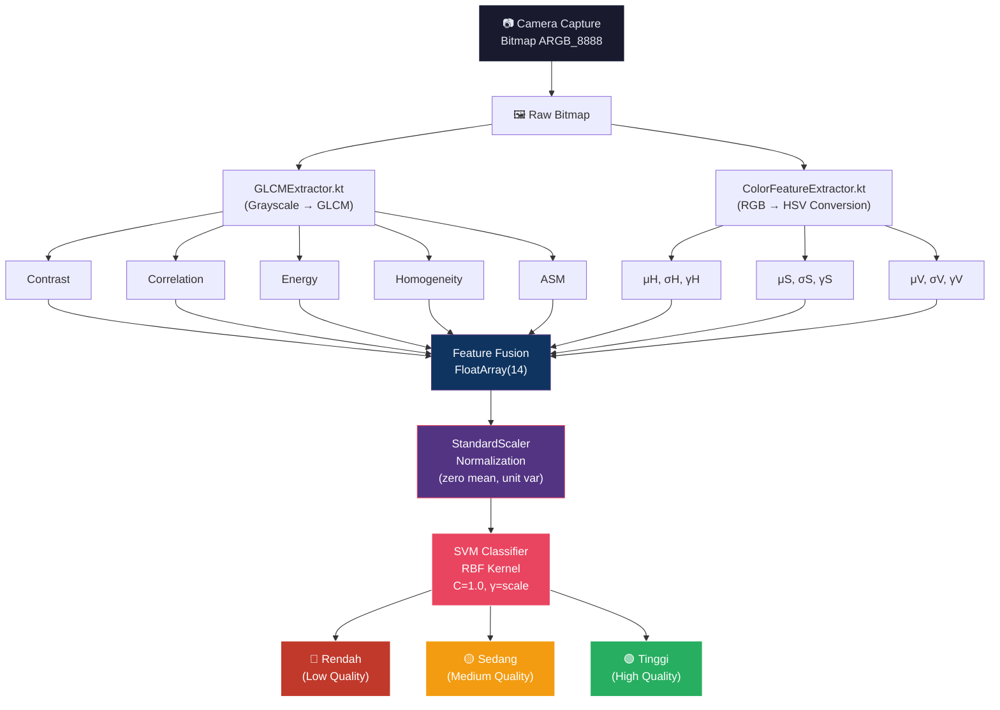
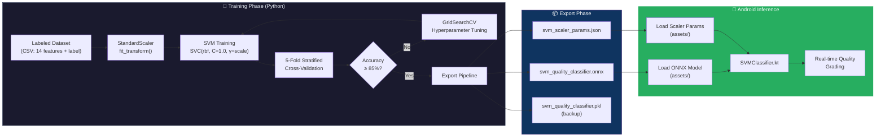
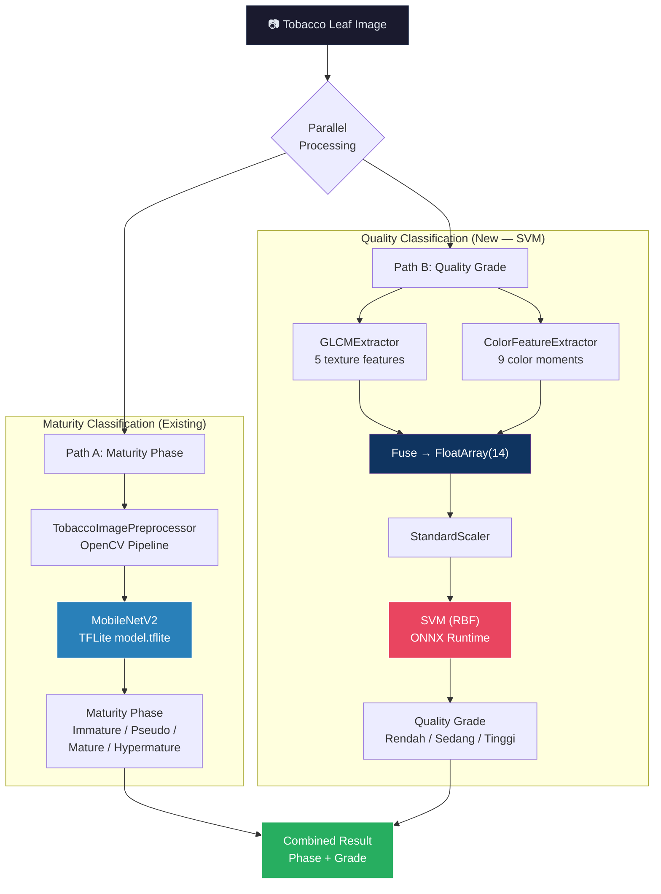

# SVM Architecture Design — Tobacco Leaf Quality Classification
### SmartLeaf Tobacco Grader · PKM-KC 2026

---

**Sprint Reference** : June 9, 2026 — SVM Architecture Design  
**Document Version** : 1.0  
**Author**           : SmartLeaf PKM-KC 2026 Team  
**Status**           : 📐 Approved Design — Ready for Training Implementation  
**Last Updated**     : June 12, 2026  

---

## Table of Contents

1. [Executive Summary](#1-executive-summary)
2. [Problem Statement](#2-problem-statement)
3. [System Context](#3-system-context)
4. [Feature Engineering Pipeline](#4-feature-engineering-pipeline)
5. [SVM Model Specification](#5-svm-model-specification)
6. [Training Strategy](#6-training-strategy)
7. [Model Export & Android Deployment](#7-model-export--android-deployment)
8. [Inference Pipeline on Android](#8-inference-pipeline-on-android)
9. [Pipeline Diagrams](#9-pipeline-diagrams)
10. [Evaluation Metrics & Acceptance Criteria](#10-evaluation-metrics--acceptance-criteria)
11. [Risk Analysis & Mitigations](#11-risk-analysis--mitigations)
12. [References](#12-references)

---

## 1. Executive Summary

This document specifies the architecture of a **Support Vector Machine (SVM)** classifier
for tobacco leaf quality grading in the SmartLeaf Android application. The SVM operates
on a **14-dimensional fused feature vector** combining 5 GLCM texture features and
9 HSV color moment features, classifying tobacco leaves into **3 quality grades:**
**Rendah** (Low), **Sedang** (Medium), and **Tinggi** (High).

The SVM complements the existing TFLite-based MobileNetV2 maturity classifier
(`ClassifierHelper.kt`) by providing an **interpretable, lightweight, and
scientifically-grounded** quality assessment that leverages handcrafted domain features
rather than opaque deep learning representations.

### Why SVM Over Deep Learning for Quality Grading?

| Criterion | SVM | Deep Learning (CNN) |
|-----------|-----|---------------------|
| Training data requirement | ~200–500 samples sufficient | 5,000+ typically needed |
| Feature interpretability | Each of 14 features has physical meaning | Black-box |
| On-device inference speed | < 1 ms (14 floats × kernel) | ~50 ms (224×224×3 tensor) |
| Model size | < 50 KB (.pkl or ONNX) | ~8 MB (MobileNetV2 TFLite) |
| Domain expert validation | Features can be audited | Not feasible |

---

## 2. Problem Statement

Indonesian tobacco leaf quality grading (sortasi mutu) is traditionally performed by
manual visual inspection, which suffers from:

- **Subjectivity:** Graders disagree on borderline samples (inter-rater κ < 0.6)
- **Fatigue:** Accuracy degrades after ~2 hours of continuous grading
- **Inconsistency:** Same leaf may receive different grades on different days

SmartLeaf solves this by encoding **two complementary visual properties** — texture
(via GLCM) and color (via HSV moments) — into a compact numerical vector, then
applying an SVM classifier trained on expert-labeled reference samples.

---

## 3. System Context

The SVM quality classifier fits into the existing SmartLeaf ML pipeline as follows:

```
┌─────────────────────────────────────────────────────────────────────────┐
│                     SmartLeaf ML Architecture                          │
├─────────────────────────────────────────────────────────────────────────┤
│                                                                        │
│  ┌──────────┐     ┌─────────────────────┐     ┌──────────────────────┐ │
│  │ CameraX  │────▶│ TobaccoImagePreproc │────▶│ MobileNetV2 (TFLite) │ │
│  │ Capture  │     │ (OpenCV Pipeline)    │     │ Maturity Phase:       │ │
│  └──────────┘     └─────────┬───────────┘     │ Immature/Pseudo/      │ │
│                             │                  │ Mature/Hypermature    │ │
│                             │                  └──────────────────────┘ │
│                             │                                          │
│                     ┌───────▼───────┐                                  │
│                     │  Raw Bitmap   │                                   │
│                     │ (ARGB_8888)   │                                   │
│                     └───┬───────┬───┘                                  │
│                         │       │                                      │
│              ┌──────────▼──┐  ┌─▼─────────────────┐                   │
│              │GLCMExtractor│  │ColorFeatureExtract.│                   │
│              │ 5 features  │  │ 9 features (HSV)   │                   │
│              └──────┬──────┘  └──────────┬─────────┘                  │
│                     │                    │                              │
│                     └────────┬───────────┘                             │
│                              │                                         │
│                     ┌────────▼────────┐                                │
│                     │  Feature Fusion  │                               │
│                     │ FloatArray(14)   │                                │
│                     └────────┬────────┘                                │
│                              │                                         │
│                     ┌────────▼────────┐                                │
│                     │  SVM Classifier  │  ◀── THIS DOCUMENT           │
│                     │  (RBF Kernel)    │                               │
│                     │  3 Classes       │                                │
│                     └────────┬────────┘                                │
│                              │                                         │
│                     ┌────────▼────────┐                                │
│                     │ Quality Grade:   │                               │
│                     │ Rendah/Sedang/   │                                │
│                     │ Tinggi           │                                │
│                     └─────────────────┘                                │
│                                                                        │
└─────────────────────────────────────────────────────────────────────────┘
```

### Existing Codebase Components

| Component | File | Status |
|-----------|------|--------|
| GLCM Texture Extractor | `app/.../ml/vision/GLCMExtractor.kt` | ✅ Implemented (June 7) |
| HSV Color Moment Extractor | `app/.../ml/vision/ColorFeatureExtractor.kt` | ✅ Implemented (June 8) |
| Image Preprocessor (OpenCV) | `app/.../ml/vision/TobaccoImagePreprocessor.kt` | ✅ Implemented |
| MobileNetV2 Maturity Classifier | `app/.../tflite/ClassifierHelper.kt` | ✅ Implemented |
| Black Matte Validator | `app/.../ml/vision/BlackMatteValidatorAnalyzer.kt` | ✅ Implemented |
| **SVM Quality Classifier** | `app/.../ml/SVMClassifier.kt` | 🔜 **To be implemented** |
| **SVM Training Script** | `ml/svm_training.py` | 🔜 **To be implemented** |

---

## 4. Feature Engineering Pipeline

### 4.1 GLCM Texture Features (5 dimensions)

Extracted via `GLCMExtractor.kt` — a zero-dependency, pure-Kotlin GLCM implementation
cross-validated against `skimage.feature.graycoprops`.

The GLCM is computed at 4 angular offsets (0°, 45°, 90°, 135°) with `symmetric=True`
and `levels=256`. The 5 features are **averaged across all 4 offsets** to produce a
single rotation-invariant texture descriptor.

| Index | Feature | Mathematical Definition | Physical Meaning |
|-------|---------|------------------------|-------------------|
| 0 | **Contrast** | Σ\_ij (i − j)² · P[i,j] | Local intensity variation (edge sharpness) |
| 1 | **Correlation** | Σ\_ij ((i−μᵢ)(j−μⱼ)·P[i,j])/(σᵢ·σⱼ) | Linear dependency between neighboring pixels |
| 2 | **Energy** | √(Σ\_ij P[i,j]²) | Textural uniformity (√ASM) |
| 3 | **Homogeneity** | Σ\_ij P[i,j] / (1 + \|i−j\|) | Closeness of distribution to GLCM diagonal |
| 4 | **ASM** | Σ\_ij P[i,j]² | Angular Second Moment (raw uniformity) |

**Source:** `GLCMExtractor.GLCMResult.averageFeatures` → `[contrast, correlation, energy, homogeneity, asm]`

### 4.2 HSV Color Moment Features (9 dimensions)

Extracted via `ColorFeatureExtractor.kt` — a pure-Kotlin implementation using
`android.graphics.Color.colorToHSV()` with a two-pass numerically stable algorithm.

For each of the 3 HSV channels, 3 statistical moments are computed:

| Index | Feature | Formula | Physical Meaning |
|-------|---------|---------|-------------------|
| 5 | **H Mean** (μ\_H) | (1/N) · Σᵢ Hᵢ | Dominant hue of the leaf |
| 6 | **H Std Dev** (σ\_H) | √((1/N) · Σᵢ (Hᵢ − μ)²) | Hue variation/uniformity |
| 7 | **H Skewness** (γ\_H) | ∛((1/N) · Σᵢ (Hᵢ − μ)³) | Hue distribution asymmetry |
| 8 | **S Mean** (μ\_S) | (1/N) · Σᵢ Sᵢ | Average color saturation |
| 9 | **S Std Dev** (σ\_S) | √((1/N) · Σᵢ (Sᵢ − μ)²) | Saturation spread |
| 10 | **S Skewness** (γ\_S) | ∛((1/N) · Σᵢ (Sᵢ − μ)³) | Saturation asymmetry |
| 11 | **V Mean** (μ\_V) | (1/N) · Σᵢ Vᵢ | Average brightness |
| 12 | **V Std Dev** (σ\_V) | √((1/N) · Σᵢ (Vᵢ − μ)²) | Brightness variation |
| 13 | **V Skewness** (γ\_V) | ∛((1/N) · Σᵢ (Vᵢ − μ)³) | Brightness asymmetry |

**Source:** `ColorFeatureExtractor.ColorMomentResult.featureVector` → `FloatArray(9)`

> **Note:** Skewness uses the cube-root formulation (Stricker & Orengo, 1995), which is
> inherently NaN-safe — no division by σ³ is performed. When σ = 0 (constant channel),
> the skewness is exactly 0.0.

### 4.3 Fused 14-Dimensional Feature Vector

The final input to the SVM is a concatenation of both feature sets:

```
fused_vector = FloatArray(14)

┌─────────────────────────────────────────────────────────────────┐
│ Index │  0  │  1  │  2  │  3  │  4  │  5  │  6  │  7  │  8  │
│ ──────┼─────┼─────┼─────┼─────┼─────┼─────┼─────┼─────┼─────│
│ Name  │CNTR │CORR │ENRG │HOMO │ ASM │ μH  │ σH  │ γH  │ μS  │
│ ──────┼─────┼─────┼─────┼─────┼─────┼─────┼─────┼─────┼─────│
│ Source│      GLCM (5)         │       HSV Color Moments        │
└───────────────────────────────┘                                │
                                                                  │
┌─────────────────────────────────────────────────────────────────┘
│ Index │  9  │ 10  │ 11  │ 12  │ 13  │
│ ──────┼─────┼─────┼─────┼─────┼─────│
│ Name  │ σS  │ γS  │ μV  │ σV  │ γV  │
│ ──────┼─────┼─────┼─────┼─────┼─────│
│ Source│        HSV Color Moments     │
└──────────────────────────────────────┘
```

### 4.4 Feature Normalization

Before SVM training, all 14 features **must** be normalized using `StandardScaler`
(zero mean, unit variance). This is critical because:

1. **GLCM features** have heterogeneous scales (Contrast ∈ [0, ~65k], Correlation ∈ [−1, 1])
2. **HSV features** have different ranges (Hue ∈ [0, 360], Saturation ∈ [0, 1])
3. The **RBF kernel** computes L2 distances, which are dominated by large-scale features
   without normalization

The `StandardScaler` **must be fitted on the training set only** and applied (`.transform()`)
to both training and test sets to prevent data leakage.

> **⚠️ Critical:** The fitted scaler parameters (mean\_ and scale\_) must be exported
> alongside the SVM model for use during Android inference. See [Section 7](#7-model-export--android-deployment).

---

## 5. SVM Model Specification

### 5.1 Kernel Selection: RBF (Radial Basis Function)

```python
from sklearn.svm import SVC

model = SVC(
    kernel='rbf',       # Radial Basis Function kernel
    C=1.0,              # Regularization parameter
    gamma='scale',      # γ = 1 / (n_features × Var(X))
    class_weight=None,  # Balanced via stratified sampling
    probability=True,   # Enable Platt scaling for confidence scores
    random_state=42,    # Reproducibility
    cache_size=500,     # MB for kernel cache
)
```

### 5.2 Hyperparameter Justification

| Parameter | Value | Rationale |
|-----------|-------|-----------|
| `kernel` | `'rbf'` | Non-linear decision boundaries needed for overlapping leaf color distributions. RBF handles non-linearly separable classes without explicit feature engineering |
| `C` | `1.0` | Default regularization. Prevents overfitting on small datasets (N < 1000). Will be validated via cross-validation |
| `gamma` | `'scale'` | Automatic scaling: γ = 1/(n\_features × Var(X)) = 1/(14 × Var(X)). Adapts to feature variance without manual tuning |
| `probability` | `True` | Enables `predict_proba()` via Platt scaling — required for confidence display in the SmartLeaf UI |
| `class_weight` | `None` | Class balance handled via stratified K-Fold. If imbalance > 2:1, switch to `'balanced'` |

### 5.3 RBF Kernel Mathematics

The RBF kernel maps inputs into an infinite-dimensional feature space:

```
K(xᵢ, xⱼ) = exp(−γ · ‖xᵢ − xⱼ‖²)
```

where:
- `γ = 1 / (n_features × Var(X))` when `gamma='scale'`
- `‖xᵢ − xⱼ‖²` is the squared L2 (Euclidean) distance between feature vectors
- For our 14-dim vectors: `‖x − x'‖² = Σₖ₌₀¹³ (xₖ − x'ₖ)²`

### 5.4 Output Classes

| Class Label | Indonesian | English | Numeric | Typical Characteristics |
|-------------|-----------|---------|---------|------------------------|
| `rendah` | Rendah | Low Quality | 0 | High GLCM contrast, low saturation, extreme hue values |
| `sedang` | Sedang | Medium Quality | 1 | Moderate texture uniformity, average saturation |
| `tinggi` | Tinggi | High Quality | 2 | Low contrast (smooth texture), high saturation, golden hue |

### 5.5 Multi-Class Strategy

scikit-learn's `SVC` with RBF uses the **One-vs-One (OvO)** strategy by default for
multi-class classification:

- 3 classes → `C(3,2) = 3` binary classifiers: (rendah vs sedang), (rendah vs tinggi), (sedang vs tinggi)
- Final prediction via majority vote
- OvO is preferred for small datasets because each binary classifier sees only 2 classes,
  making decision boundaries cleaner

---

## 6. Training Strategy

### 6.1 Environment & Dependencies

```bash
# Python 3.10+ recommended
pip install scikit-learn==1.5.2    # SVM + StandardScaler + metrics
pip install numpy==1.26.4          # Numerical operations
pip install pandas==2.2.3          # Dataset I/O (CSV)
pip install joblib==1.4.2          # Model serialization (.pkl)
pip install skl2onnx==1.17.0       # ONNX export
pip install onnxruntime==1.19.0    # ONNX validation
pip install matplotlib==3.9.2     # Confusion matrix visualization
pip install seaborn==0.13.2        # Enhanced plotting
```

### 6.2 Dataset Format

Training data is expected as a CSV file with 14 feature columns + 1 label column:

```csv
contrast,correlation,energy,homogeneity,asm,h_mean,h_std,h_skew,s_mean,s_std,s_skew,v_mean,v_std,v_skew,label
12.345,0.876,0.234,0.789,0.055,85.2,12.3,-0.45,0.62,0.15,0.23,0.71,0.08,-0.12,tinggi
45.678,0.432,0.112,0.567,0.013,42.1,25.6,1.23,0.38,0.22,-0.67,0.45,0.19,0.89,rendah
...
```

### 6.3 Training Script Outline

```python
#!/usr/bin/env python3
"""
SmartLeaf SVM Training Script
Sprint: June 9, 2026 — SVM Architecture Design

Trains an SVM classifier on the fused 14-dimensional feature vector
(5 GLCM + 9 HSV color moments) for tobacco leaf quality grading.
"""

import numpy as np
import pandas as pd
import joblib
from sklearn.svm import SVC
from sklearn.preprocessing import StandardScaler, LabelEncoder
from sklearn.model_selection import StratifiedKFold, cross_val_score
from sklearn.metrics import (
    classification_report,
    confusion_matrix,
    ConfusionMatrixDisplay,
)

# ─────────────────────────────────────────────────────────
# 1. Load Dataset
# ─────────────────────────────────────────────────────────
FEATURE_COLUMNS = [
    # GLCM (5)
    'contrast', 'correlation', 'energy', 'homogeneity', 'asm',
    # HSV Color Moments (9)
    'h_mean', 'h_std', 'h_skew',
    's_mean', 's_std', 's_skew',
    'v_mean', 'v_std', 'v_skew',
]
LABEL_COLUMN = 'label'
CLASSES = ['rendah', 'sedang', 'tinggi']

df = pd.read_csv('data/tobacco_features.csv')
X = df[FEATURE_COLUMNS].values  # shape: (N, 14)
y = df[LABEL_COLUMN].values     # shape: (N,)

# Encode labels: rendah=0, sedang=1, tinggi=2
le = LabelEncoder()
le.fit(CLASSES)
y_encoded = le.transform(y)

# ─────────────────────────────────────────────────────────
# 2. Feature Normalization (StandardScaler)
# ─────────────────────────────────────────────────────────
scaler = StandardScaler()
X_scaled = scaler.fit_transform(X)

# ─────────────────────────────────────────────────────────
# 3. SVM Training
# ─────────────────────────────────────────────────────────
svm = SVC(
    kernel='rbf',
    C=1.0,
    gamma='scale',
    probability=True,
    random_state=42,
    cache_size=500,
)

# ─────────────────────────────────────────────────────────
# 4. Stratified 5-Fold Cross-Validation
# ─────────────────────────────────────────────────────────
cv = StratifiedKFold(n_splits=5, shuffle=True, random_state=42)
scores = cross_val_score(svm, X_scaled, y_encoded, cv=cv, scoring='accuracy')
print(f"Cross-Val Accuracy: {scores.mean():.4f} ± {scores.std():.4f}")

# ─────────────────────────────────────────────────────────
# 5. Final Training on Full Dataset
# ─────────────────────────────────────────────────────────
svm.fit(X_scaled, y_encoded)

# ─────────────────────────────────────────────────────────
# 6. Export Model + Scaler
# ─────────────────────────────────────────────────────────
joblib.dump(svm, 'models/svm_quality_classifier.pkl')
joblib.dump(scaler, 'models/svm_feature_scaler.pkl')
joblib.dump(le, 'models/svm_label_encoder.pkl')

print("✅ Model, Scaler, and Encoder exported to models/")
```

### 6.4 Cross-Validation Strategy

```
Stratified 5-Fold Cross-Validation
┌──────────┬──────────┬──────────┬──────────┬──────────┐
│  Fold 1  │  Fold 2  │  Fold 3  │  Fold 4  │  Fold 5  │
│   TEST   │  train   │  train   │  train   │  train   │  → Accuracy₁
│  train   │   TEST   │  train   │  train   │  train   │  → Accuracy₂
│  train   │  train   │   TEST   │  train   │  train   │  → Accuracy₃
│  train   │  train   │  train   │   TEST   │  train   │  → Accuracy₄
│  train   │  train   │  train   │  train   │   TEST   │  → Accuracy₅
└──────────┴──────────┴──────────┴──────────┴──────────┘
                                         
Final Accuracy = mean(Accuracy₁..₅) ± std(Accuracy₁..₅)
```

Each fold maintains the same class ratio (rendah:sedang:tinggi) as the full dataset
via stratification — critical for avoiding biased evaluation on small datasets.

### 6.5 Hyperparameter Tuning (Optional)

If cross-validation accuracy is < 85%, perform grid search:

```python
from sklearn.model_selection import GridSearchCV

param_grid = {
    'C': [0.1, 1.0, 10.0, 100.0],
    'gamma': ['scale', 'auto', 0.01, 0.001],
}

grid = GridSearchCV(
    SVC(kernel='rbf', probability=True, random_state=42),
    param_grid,
    cv=StratifiedKFold(5, shuffle=True, random_state=42),
    scoring='accuracy',
    n_jobs=-1,
    verbose=2,
)
grid.fit(X_scaled, y_encoded)
print(f"Best: {grid.best_score_:.4f} with {grid.best_params_}")
```

---

## 7. Model Export & Android Deployment

### 7.1 Export Format Comparison

| Format | Pros | Cons | Recommended |
|--------|------|------|-------------|
| **`.pkl` (joblib)** | Exact scikit-learn reproduction, easy debugging | Requires Python runtime → not native on Android | ✅ **For training validation** |
| **ONNX** | Cross-platform, native C++ runtime, ONNX Runtime Mobile supports Android | Platt scaling may need manual handling | ✅ **For production deployment** |
| **Manual JSON coefficients** | Zero dependencies, pure Kotlin inference | Only feasible for linear SVM (not RBF) | ❌ Not viable |

### 7.2 Primary Strategy: ONNX Export

```python
from skl2onnx import convert_sklearn
from skl2onnx.common.data_types import FloatTensorType
import onnxruntime as ort

# ─────────────────────────────────────────────────────────
# Export SVM + Scaler as a single ONNX pipeline
# ─────────────────────────────────────────────────────────
from sklearn.pipeline import Pipeline

pipeline = Pipeline([
    ('scaler', scaler),
    ('svm', svm),
])

initial_type = [('float_input', FloatTensorType([None, 14]))]

onnx_model = convert_sklearn(
    pipeline,
    initial_types=initial_type,
    target_opset=15,
    options={
        id(svm): {'zipmap': False}  # Return array instead of dict
    },
)

# Save ONNX model
with open('models/svm_quality_classifier.onnx', 'wb') as f:
    f.write(onnx_model.SerializeToString())

# ─────────────────────────────────────────────────────────
# Validate ONNX model output matches sklearn
# ─────────────────────────────────────────────────────────
sess = ort.InferenceSession('models/svm_quality_classifier.onnx')
onnx_pred = sess.run(None, {'float_input': X_scaled[:5].astype(np.float32)})

sklearn_pred = svm.predict(X_scaled[:5])
assert np.array_equal(onnx_pred[0], sklearn_pred), "ONNX output mismatch!"
print("✅ ONNX validation passed — outputs match scikit-learn.")
```

### 7.3 Fallback Strategy: Scaler Parameters + `.pkl`

For early-stage development or if ONNX Runtime Mobile integration is deferred,
export the scaler parameters as a JSON file for pure-Kotlin normalization:

```python
import json

scaler_params = {
    'mean': scaler.mean_.tolist(),      # List[float] of length 14
    'scale': scaler.scale_.tolist(),    # List[float] of length 14
}

with open('models/svm_scaler_params.json', 'w') as f:
    json.dump(scaler_params, f, indent=2)
```

### 7.4 Android Asset Placement

```
app/
├── src/main/
│   └── assets/
│       ├── model.tflite                       ← Existing MobileNetV2
│       ├── svm_quality_classifier.onnx        ← NEW: SVM model
│       └── svm_scaler_params.json             ← NEW: Scaler parameters
```

---

## 8. Inference Pipeline on Android

### 8.1 Kotlin Integration Architecture

```kotlin
// Planned file: app/.../ml/SVMClassifier.kt

class SVMClassifier(context: Context) {

    // Load ONNX model from assets via ONNX Runtime Mobile
    // Load scaler parameters from JSON

    suspend fun classify(bitmap: Bitmap): QualityResult =
        withContext(Dispatchers.Default) {

            // 1. Extract GLCM features (5-dim)
            val glcmResult = glcmExtractor.extract(bitmap)
            val glcmFeatures = glcmResult.averageFeatures

            // 2. Extract HSV Color Moment features (9-dim)
            val colorResult = colorExtractor.extract(bitmap)
            val colorFeatures = colorResult.featureVector

            // 3. Fuse into 14-dim vector
            val fused = FloatArray(14).apply {
                this[0]  = glcmFeatures.contrast.toFloat()
                this[1]  = glcmFeatures.correlation.toFloat()
                this[2]  = glcmFeatures.energy.toFloat()
                this[3]  = glcmFeatures.homogeneity.toFloat()
                this[4]  = glcmFeatures.asm.toFloat()
                System.arraycopy(colorFeatures, 0, this, 5, 9)
            }

            // 4. Normalize using exported scaler params
            val normalized = normalize(fused)

            // 5. Run ONNX inference
            val prediction = onnxSession.run(normalized)

            // 6. Map to quality grade
            mapToQualityResult(prediction)
        }
}
```

### 8.2 Quality Result Data Class

```kotlin
data class QualityResult(
    val grade: QualityGrade,     // rendah, sedang, tinggi
    val confidence: Float,       // 0.0 – 1.0
    val probabilities: FloatArray // [P(rendah), P(sedang), P(tinggi)]
)

enum class QualityGrade(val label: String, val displayName: String) {
    RENDAH("rendah", "Rendah (Low)"),
    SEDANG("sedang", "Sedang (Medium)"),
    TINGGI("tinggi", "Tinggi (High)"),
}
```

---

## 9. Pipeline Diagrams

### 9.1 Feature-to-Class Pipeline (End-to-End)



### 9.2 Training & Deployment Workflow



### 9.3 Dual-Model Architecture Overview



---

## 10. Evaluation Metrics & Acceptance Criteria

### 10.1 Required Metrics

| Metric | Target | Rationale |
|--------|--------|-----------|
| **Overall Accuracy** | ≥ 85% | Minimum for field deployment |
| **Per-class F1 Score** | ≥ 0.80 each | Ensures no class is neglected |
| **Cross-val Std Dev** | ≤ 0.05 | Model stability across folds |
| **Inference Latency** | < 5 ms (14-dim) | Must not add perceptible delay |
| **Model Size** | < 500 KB (ONNX) | Must fit in APK without bloat |

### 10.2 Confusion Matrix Template

```
                  Predicted
              rendah  sedang  tinggi
Actual rendah  [ TP ]  [ FP ]  [ FP ]
       sedang  [ FN ]  [ TP ]  [ FP ]
       tinggi  [ FN ]  [ FN ]  [ TP ]
```

### 10.3 Classification Report Template

```
              precision    recall  f1-score   support
      rendah       0.xx      0.xx      0.xx       N₁
      sedang       0.xx      0.xx      0.xx       N₂
      tinggi       0.xx      0.xx      0.xx       N₃

    accuracy                           0.xx      N_total
   macro avg       0.xx      0.xx      0.xx      N_total
weighted avg       0.xx      0.xx      0.xx      N_total
```

---

## 11. Risk Analysis & Mitigations

| Risk | Likelihood | Impact | Mitigation |
|------|-----------|--------|------------|
| Insufficient training data (< 100 samples) | Medium | High — SVM overfits | Data augmentation via horizontal flips, brightness jitter in feature space |
| Class imbalance (rendah >> tinggi) | High | Medium — biased predictions | Use `class_weight='balanced'` or SMOTE oversampling |
| Feature scale mismatch at inference | Low | Critical — wrong predictions | Export scaler params alongside model; unit test the normalization |
| ONNX Runtime Mobile compatibility | Low | Medium — delays deployment | Fallback: pure-Kotlin inference with exported support vectors (feasible for small N\_sv) |
| Concept drift (seasonal leaf variations) | Medium | Medium — accuracy decay | Quarterly re-training with fresh samples; monitor prediction confidence distribution |
| Hue wrap-around (360° ↔ 0°) | Low | Low — affects μ\_H for red-ish leaves | Tobacco hues are typically 30°–120° (green→yellow); wrap-around is unlikely |

---

## 12. References

1. **Haralick, R. M., Shanmugam, K., & Dinstein, I.** (1973). "Textural Features for Image Classification." *IEEE Transactions on Systems, Man, and Cybernetics*, SMC-3(6), 610–621.

2. **Stricker, M. A., & Orengo, M.** (1995). "Similarity of Color Images." *Proc. SPIE Storage and Retrieval for Image and Video Databases III*, 2420, 381–392.

3. **Cortes, C., & Vapnik, V.** (1995). "Support-Vector Networks." *Machine Learning*, 20(3), 273–297.

4. **Pedregosa, F., et al.** (2011). "Scikit-learn: Machine Learning in Python." *JMLR*, 12, 2825–2830.

5. **ONNX Runtime.** (2024). *ONNX Runtime Mobile for Android.* https://onnxruntime.ai/docs/tutorials/mobile/

6. **scikit-learn Documentation.** `sklearn.svm.SVC`. https://scikit-learn.org/stable/modules/generated/sklearn.svm.SVC.html

---

> **© 2026 SmartLeaf Tobacco Grader — PKM-KC 2026, Politeknik Elektronika Negeri Surabaya (PENS)**
